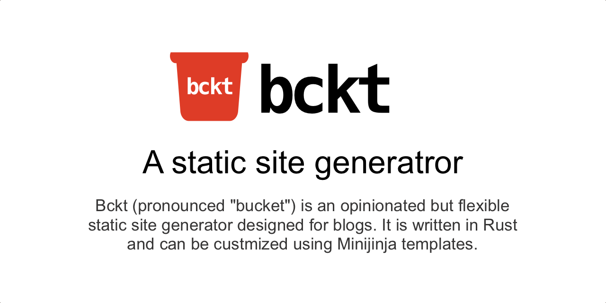

# bckt

`bckt` (pronounced "bucket") is one more static site generator.

`bckt` is designed to blend different kinds of content into a single site,
so you can mix long-form posts, link logs, photos, and other content -your personal content bucket :-)

It ships with a clean theme, incremental rebuilds, and a minimal toolchain so
you can publish from Markdown or hand-written HTML without ceremony.

> [! WARNING]
> `bckt` is expected to run in a trusted envioronment, where templates
> and content can be trusted (like your laptop or personal server).
> Using it to render third-party content (for example a public bckt-SaaS) 
> is not recommended yet.

## Highlights

- Fast incremental renders with optional watch mode (`bckt dev`).
- Theme-first workflow powered by MiniJinja templates (`themes/bckt3`).
- Built-in client-side search index generation and custom template filters.
- Straightforward YAML front matter with automatic tags and archive pages.

Pre-built binaries live on the
[releases page](https://github.com/vrypan/bckt/releases). You can also
compile locally with `cargo install --path .`.

## Get Started

```bash
bckt init                     # scaffold posts/, templates/, skel/, bckt.yaml
bckt render                   # generate html/
bckt dev --changed --verbose  # preview with live reload
```

Deploy by publishing the generated `html/` directory with any static host.

## Documentation

Detailed guides live in [`docs/`](docs/README.md):

- Theme structure (templates, pages, static assets)
- Custom MiniJinja filters such as `format_date`
- Client-side search integration and configuration tips

## Contributing

```bash
cargo fmt
cargo clippy -- -D warnings
cargo test
```

Issues and pull requests are welcome.

## Extras

The companion `bckt-fc` command shows how different types of content can be integrated in a bckt blog in practice: run it to fetch a Farcaster cast (and its attached images and videos) and drop them straight into your blog, then render as usual (the default theme includes templates to render farcaster posts).
