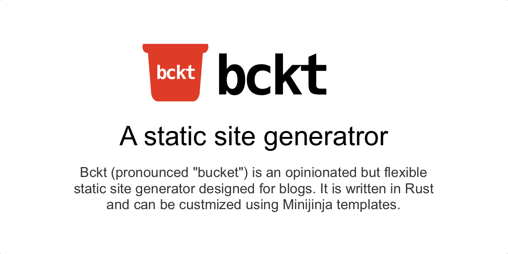

# bckt

`bckt` (pronounced "bucket") is one more static site generator.

`bckt` is designed to blend different kinds of content into a single site,
so you can mix long-form posts, link logs, photos, and other content -your personal content bucket :-)

It ships with a clean theme, incremental rebuilds, and a minimal toolchain so
you can publish from Markdown or hand-written HTML without ceremony.

> [!WARNING]
> `bckt` is expected to run in a trusted envioronment, where templates
> and content can be trusted (like your own machine).
> Using it to render third-party content (for example a public bckt-SaaS) 
> is not recommended yet.

## Highlights

- Fast incremental renders with optional watch mode (`bckt dev`).
- Theme-first workflow powered by MiniJinja templates (`themes/bckt3`).
- Built-in client-side search index generation and custom template filters.
- Straightforward YAML front matter with automatic tags and archive pages.

Pre-built binaries live on the
[releases page](https://github.com/vrypan/bckt/releases). You can also
compile locally with `cargo install --path .`.

## Demo

bckt ships with two demo content sets you can use to try out a theme
before writing your own posts.

**`microblog`** — short titleless notes, good for `micro` and `microx`:

```bash
mkdir myblog && cd myblog
bckt init --theme micro --demo microblog
bckt dev
```

**`articles`** — longer posts with titles, good for `modern`, `bckt3`, `plain`, `rntz`:

```bash
mkdir myblog && cd myblog
bckt init --theme modern --demo articles
bckt dev
```

You can combine any theme with any demo. To try a different theme on
the same demo content:

```bash
bckt themes install micro
bckt themes use micro
bckt render
```

The six bundled themes are: `bckt3`, `micro`, `microx`, `modern`,
`plain`, `rntz`.

You can also check [blog.vrypan.net](https://blog.vrypan.net/) — a
live site built with bckt and a slightly modified default theme — and
[steve.photo](https://steve.photo), built using bckt and bckt-photo
(see [Extras](#extras)).

## Get Started

```bash
bckt init  --theme bckt3       # scaffold posts/, templates/, skel/, bckt.yaml
# edit bckt.yaml
bckt-new --title "Hello"      # scaffold a new post (prompts for missing fields)
bckt render                   # generate html/
bckt dev --verbose            # preview with live reload
```

Deploy by publishing the generated `html/` directory with any static host.

## Documentation

Detailed guides live in [`docs/`](docs/README.md):

- Posts organization, frontmatter, and `.bcktignore` for excluding directories
- Theme structure (templates, pages, static assets)
- Attachment metadata (file sizes and MIME types) in templates
- Custom MiniJinja filters such as `format_date`
- Client-side search integration and configuration tips
